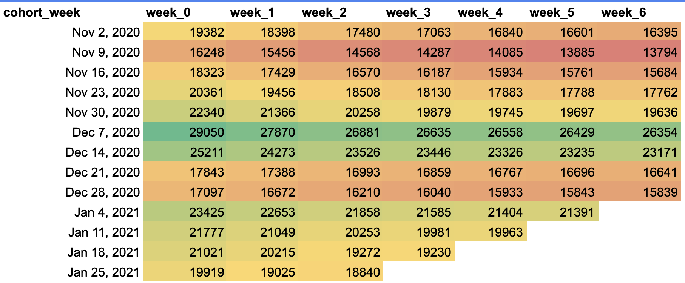
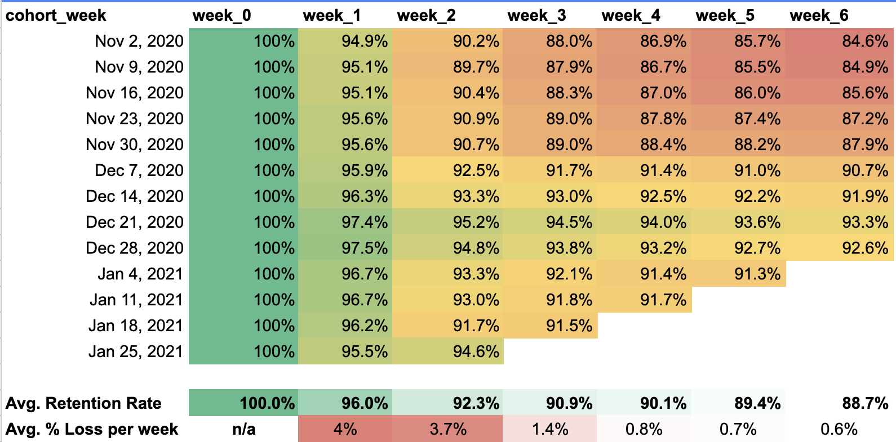
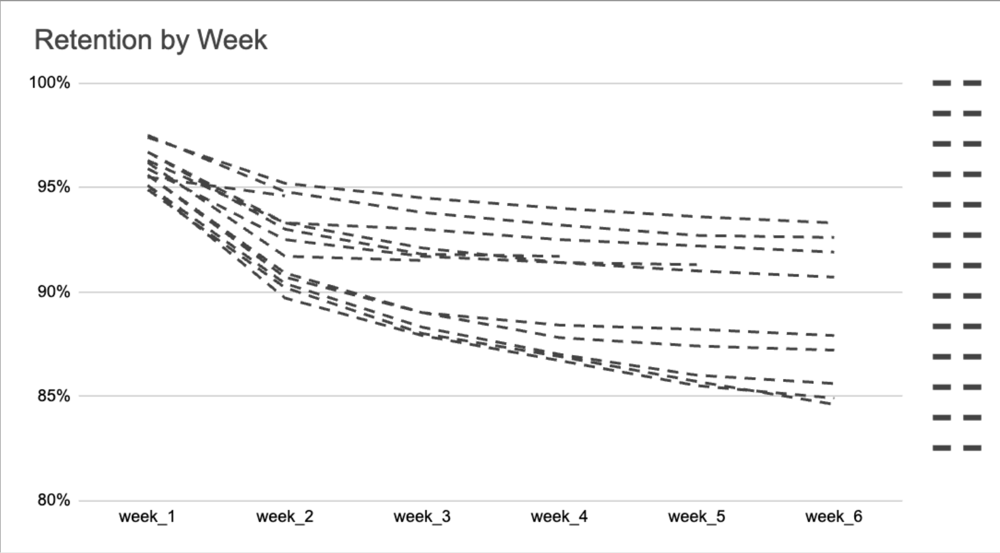

# Weekly Subscription Retention Analysis


## Why This Matters
Subscription businesses live and die by retention. Understanding when users churn and how retention evolves allows you to:

- **Spot trends:** Identify which cohorts stay and which leave early.  
- **Reduce churn:** Pinpoint early drop-off periods to fix onboarding or expectations.  
- **Inform strategy:** Learn what campaigns or offers drove strong retention.  
- **Boost revenue:** Keeping existing subscribers is cheaper than acquiring new ones.

## Project Overview
This project analyzes weekly retention rates for subscriber cohorts over a 6-week period. Monthly retention data can mask early churn patterns, so a weekly view uncovers actionable insights for growth and engagement.  

**Data:** [Google Sheet with cohort data](https://docs.google.com/spreadsheets/d/1Ud475bs00X0tn-7WE20XPvwzR1_QgaHloUOJ1lQ-O4U/edit?gid=2010630371#gid=2010630371)

**Goal:** Track user activity, identify retention drop-offs, and provide recommendations to reduce churn.

---

## How to Read the Cohort Table
Each row represents a cohort of users who signed up in a specific week. Columns show retention over subsequent weeks:  

| Column | Description |
|--------|-------------|
| `cohort_week` | Week users joined |
| `week_0` | Total users in cohort |
| `week_1`–`week_6` | Percentage of users still active each week |

**Example:**  
- `Dec 7, 2020: 29,050 users`  
- `Week 1 retention: 27,870 users (95.9%)`  
- `Week 6 retention: 26,354 users (90.7%)`  

This shows that while some churn happens, the majority remain active across six weeks.

---

## Key Visuals

### 1️⃣ Absolute Numbers


### 2️⃣ Retention Percentages


### 3️⃣ Cohort Line Chart


- Most cohorts show an **inflection point at week 2**, indicating early churn patterns.

---

## Insights & Recommendations

1. **Highest onboarding week:** Dec 7 – 28,870 users  
   **Action:** Investigate marketing campaigns or promotions driving spikes.  

2. **Best retention cohort:** Dec 21 – Week 1: 97.4%, Week 6: 93.3%  
   **Action:** Study successful tactics and replicate where possible.  

3. **Largest early churn:** Weeks 1–2 drop 7.7%  
   **Action:** Identify causes like unmet expectations or weak onboarding; fix promptly.  

4. **Overall trend:** Average retention improved 8% (from 84.6% to 92.6%) over 9 weeks  
   **Action:** Monitor strategy effectiveness and continue optimizing engagement.

---

## Quick Stats
| Metric | Value |
|--------|-------|
| Total subscriptions analyzed | 272,106 |
| Peak cohort size | 29,050 (Dec 7, 2020) |
| Average weekly retention | 96% → 88.7% (Week 6) |
| Average % loss per week | Week 1: 4%, Week 2: 3.7%, Week 3+: <1% |

---

## Next Steps
- Analyze causes of week-2 churn across cohorts.  
- Test replication of Dec 21 strategies in other weeks.  
- Gather feedback from retained users to inform product improvements.  
- Explore cohort retention by device type or region for deeper segmentation.

---

## SQL Code

### 1️⃣ Table with Absolute Numbers
```sql
WITH 
cohort_data AS (
    SELECT
      user_pseudo_id,
      DATE_TRUNC(subscription_start, WEEK(MONDAY)) AS cohort_week,
      subscription_start,
      COALESCE(subscription_end, '2021-02-07') AS subscription_end
    FROM
       `turing_data_analytics.subscriptions`
  WHERE 
    subscription_start >= '2020-11-02'
)

SELECT
    cohort_week,
    COUNT(user_pseudo_id) AS week_0_subs,
    SUM(CASE WHEN DATE_DIFF(subscription_end, cohort_week, WEEK) >=0 THEN 1 ELSE 0 END) AS week_0,
    SUM(CASE WHEN DATE_DIFF(subscription_end, cohort_week, WEEK) >=1 THEN 1 ELSE 0 END) AS week_1,
    SUM(CASE WHEN DATE_DIFF(subscription_end, cohort_week, WEEK) >=2 THEN 1 ELSE 0 END) AS week_2,
    SUM(CASE WHEN DATE_DIFF(subscription_end, cohort_week, WEEK) >=3 THEN 1 ELSE 0 END) AS week_3,
    SUM(CASE WHEN DATE_DIFF(subscription_end, cohort_week, WEEK) >=4 THEN 1 ELSE 0 END) AS week_4,
    SUM(CASE WHEN DATE_DIFF(subscription_end, cohort_week, WEEK) >=5 THEN 1 ELSE 0 END) AS week_5,
    SUM(CASE WHEN DATE_DIFF(subscription_end, cohort_week, WEEK) >=6 THEN 1 ELSE 0 END) AS week_6
FROM
    cohort_data
GROUP BY
    cohort_week
ORDER BY
    cohort_week

```
### 2️⃣ Table with Retention Percentages

```sql
WITH 
cohort_data AS (
    SELECT
      user_pseudo_id,
      DATE_TRUNC(subscription_start, WEEK(MONDAY)) AS cohort_week,
      subscription_start,
      COALESCE(subscription_end, '2021-02-07') AS subscription_end
    FROM
       `turing_data_analytics.subscriptions`
  WHERE 
    subscription_start >= '2020-11-02' /*removes a 'week' that starts on 2020-10-26 and has only 1 day - 2020-11-01*/
--AND
--   subscription_start <= '2021-01-31' /*nieko nedaro, not sure kodel idedam*/
)
,
retained AS (  
SELECT
    cohort_week,
    SUM(CASE WHEN DATE_DIFF(subscription_end, cohort_week, WEEK) >=0 THEN 1 ELSE 0 END) AS week_0,
    SUM(CASE WHEN DATE_DIFF(subscription_end, cohort_week, WEEK) >=1 THEN 1 ELSE 0 END) AS week_1,
    SUM(CASE WHEN DATE_DIFF(subscription_end, cohort_week, WEEK) >=2 THEN 1 ELSE 0 END) AS week_2,
    SUM(CASE WHEN DATE_DIFF(subscription_end, cohort_week, WEEK) >=3 THEN 1 ELSE 0 END) AS week_3,
    SUM(CASE WHEN DATE_DIFF(subscription_end, cohort_week, WEEK) >=4 THEN 1 ELSE 0 END) AS week_4,
    SUM(CASE WHEN DATE_DIFF(subscription_end, cohort_week, WEEK) >=5 THEN 1 ELSE 0 END) AS week_5,
    SUM(CASE WHEN DATE_DIFF(subscription_end, cohort_week, WEEK) >=6 THEN 1 ELSE 0 END) AS week_6
FROM
    cohort_data
GROUP BY
    cohort_week
ORDER BY
    cohort_week
)

SELECT
  cohort_week,
  IF(week_0 = 0, NULL, CONCAT(ROUND(100 * week_1 / week_1, 1), '%')) AS week_0,
  IF(week_1 = 0, NULL, CONCAT(ROUND(100 * week_1 / week_0, 1), '%')) AS week_1,
  IF(week_2 = 0, NULL, CONCAT(ROUND(100 * week_2 / week_0, 1), '%')) AS week_2,
  IF(week_3 = 0, NULL, CONCAT(ROUND(100 * week_3 / week_0, 1), '%')) AS week_3,
  IF(week_4 = 0, NULL, CONCAT(ROUND(100 * week_4 / week_0, 1), '%')) AS week_4,
  IF(week_5 = 0, NULL, CONCAT(ROUND(100 * week_5 / week_0, 1), '%')) AS week_5,
  IF(week_6 = 0, NULL, CONCAT(ROUND(100 * week_6 / week_0, 1), '%')) AS week_6
FROM retained    
```
